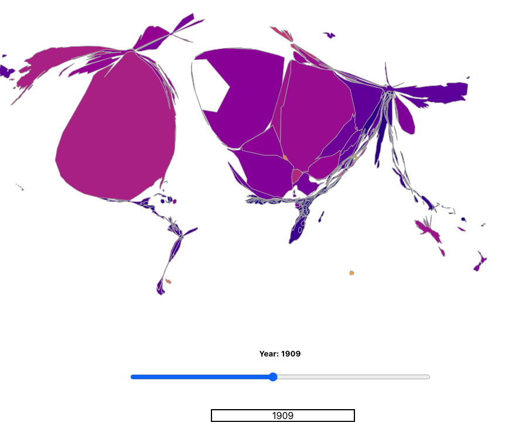

# Contiguous Cartogram Scaled By co2 Emissions

- Production-based emissions of carbon dioxide, measured in million tonnes per year by country, from 1809 to 2019

- Data from https://ourworldindata.org/co2-emissions and geographic topology from https://github.com/vasturiano/cartogram-chart

### npm install && npm start 
Open [http://localhost:3000](http://localhost:3000) to view it in the browser.

